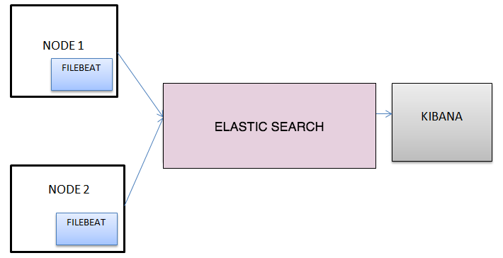
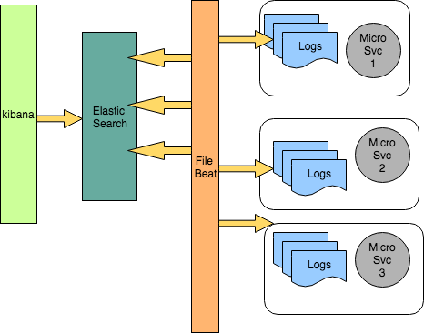

# :hammer: ATOM Structured Logging

### Goals/Problem statement:
There are quite a few problems with the current state of logging.  You have different Applications/Containers/VMs feeding into each other. Debugging an issue requires logging into each individual box to look at the logs. With small number of apps/boxes it's not an issue, but it quickly becomes tedious as the number of apps/boxes increase!

### Proposed Solution:
It would be awesome to have all of your logs aggregated into one place so you can see the process flow and perform queries against the logs from all applications from one place. And Yes, we are going to leverage the best open source projects as much as possible.

** Enter EFK stack ..

### What does EFK stands for
* Elasticsearch: Elasticsearch is a search server based on Lucene. It provides a distributed, multitenant-capable full-text search engine with a RESTful web interface and schema-free JSON documents.
* Filebeat is a log data shipper for local files. Installed as an agent on your servers, Filebeat monitors the log directories or specific log files, tails the files, and forwards them either to Elasticsearch or Logstash for indexing.
* Kibana: A nifty tool to visualize logs and timestamped data.


### Proposed Logging Architecture via EFK

<p align="center">
  
</p>

The current architecture aims at the following via Filebeat and Elastic search.

``` 
** Indexer
** Query
** Log Producer
** Collector
** Normalizer 
** Optional presentation layer

```


#### Indexing:
Lets try and index some twitter like information. First, lets create a twitter user, and add some tweets (the @twitter@ index will be created automatically):

For details
https://github.com/elastic/elasticsearch/blob/master/README.textile

<pre>
curl -XPUT 'http://localhost:9200/twitter/user/kimchy' -d '{ "name" : "Shay Banon" }'

curl -XPUT 'http://localhost:9200/twitter/tweet/1' -d '
{
    "user": "kimchy",
    "postDate": "2009-11-15T13:12:00",
    "message": "Trying out Elastic Search, so far so good?"
}'

curl -XPUT 'http://localhost:9200/twitter/tweet/2' -d '
{
    "user": "kimchy",
    "postDate": "2009-11-15T14:12:12",
    "message": "Another tweet, will it be indexed?"
}'
</pre>


Let us look at few examples:

Find out the Indices available with ES
<pre>

root@elastic-stack:/# curl -XGET 'localhost:9200/_cat/indices?v'
health status index               uuid                   pri rep docs.count docs.deleted store.size pri.store.size
yellow open   filebeat-2017.10.18 hI6C3kPHSJ6Tp4bHCAlGEg   5   1    1000000            0    113.1mb        113.1mb
yellow open   .kibana             nFtaQ5MIRq-TkpS4KXYdJQ   1   1          2            0     17.9kb         17.9kb
root@elastic-stack:/# 
root@elastic-stack:/# curl -XPOST 'localhost:9200/filebeat-2017.10.18/_search?pretty' -d '
{
   "query" : { "match" : { "level" : "info" } }
}' | more
  % Total    % Received % Xferd  Average Speed   Time    Time     Time  Current
                                 Dload  Upload   Total   Spent    Left  Speed
  0     0    0     0    0     0      0      0 --:--:-- --:--:-- --:--:--     0{
  "took" : 9,
  "timed_out" : false,
  "_shards" : {
    "total" : 5,
    "successful" : 5,
    "skipped" : 0,
    "failed" : 0
  },
  "hits" : {
    "total" : 1000000,
    "max_score" : 2.5048123E-6,
    "hits" : [
      {
        "_index" : "filebeat-2017.10.18",
        "_type" : "doc",
        "_id" : "AV8sztcoWpkpnsnnBU9d",
        "_score" : 2.5048123E-6,
        "_source" : {
          "@timestamp" : "2017-10-18T00:07:48.447Z",
          "beat" : {
            "hostname" : "elastic-stack",
            "name" : "elastic-stack",
            "version" : "5.6.2"
          },
          "caller" : "logging/main.go:28",
          "count" : 212942,
          "durationField" : 1,
          "input_type" : "log",
          "intField" : 1,
          "level" : "info",
          "msg" : "This is a sample message",

</pre>

#### Atom Log lifecycle


<p align="center">
  
</p>


```
** Generation
** Collection
** Indexing
** Retention
```


  
#### 3rdparty product logs lifecycle
```
** Generation
** Collection
** Normalization
** Indexing
** Retention
```

#### Instance of our architecture with Filebeat/ELK


<p align="center">
  
</p>


#### Security

#### Reliability with failure cases and mitigation.
